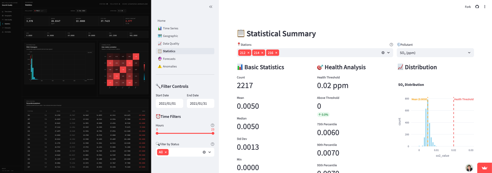
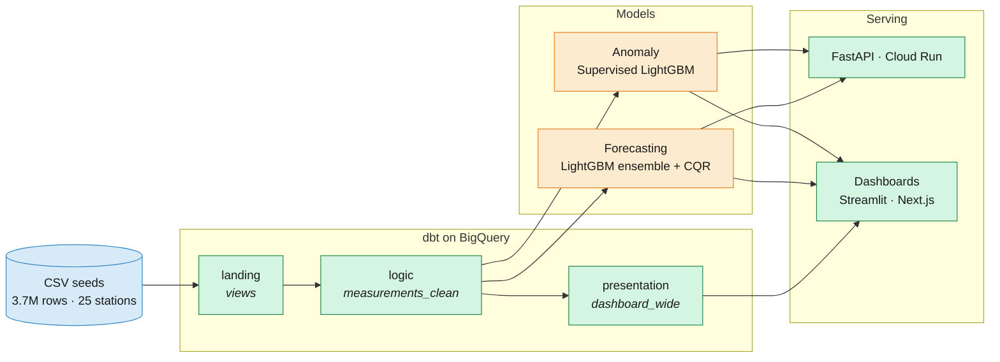
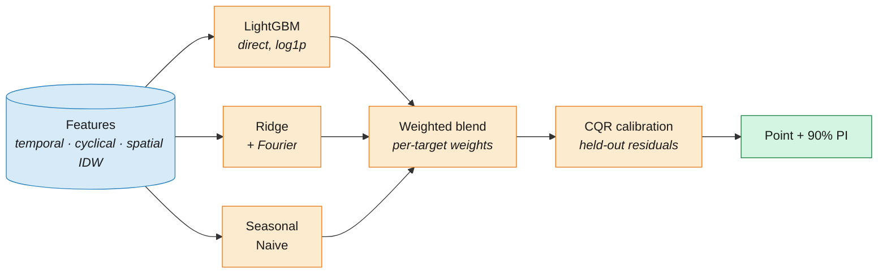

# Seoul Air Quality Prediction

[](https://bigquery-air-quality-forecasting.vercel.app)
[](https://bigquery-air-quality-mpc.streamlit.app)
[](https://github.com/mponsclo/bigquery-air-quality-forecasting/actions/workflows/lint.yml)
[](https://www.python.org/downloads/)
[](LICENSE)
[](https://github.com/astral-sh/ruff)
[](https://docs.getdbt.com/)
[](https://fastapi.tiangolo.com/)
[](https://cloud.google.com/)

End-to-end air-quality ML pipeline for 25 Seoul monitoring stations across 3 years, 3.7M hourly records, 6 pollutants. dbt on BigQuery for the data layer, a LightGBM ensemble with Conformalized Quantile Regression for month-ahead forecasting, and supervised LightGBM (F1 +100% over Isolation Forest) for anomaly detection. Served via FastAPI on Cloud Run; infrastructure on Terraform; CI/CD on GitHub Actions with SOPS/KMS for secrets.

> Built on the Schneider Electric data-science take-home dataset (Seoul air-quality, 2021-2023). Raw seed CSVs are not included (see [Data](#data)).

---

## Live demos

| **Next.js on Vercel** | **Streamlit on Community Cloud** |
|---|---|
| [bigquery-air-quality-forecasting.vercel.app](https://bigquery-air-quality-forecasting.vercel.app) | [bigquery-air-quality-mpc.streamlit.app](https://bigquery-air-quality-mpc.streamlit.app) |
| Visualization-as-code · Next.js 16 · TypeScript · ECharts · MapLibre | Reference BI-tool · Streamlit · Plotly · Folium |

[](https://bigquery-air-quality-forecasting.vercel.app)

Two dashboards, same six panels, same data, rendered two ways. The Next.js app is an experiment in whether LLM-authored, typed, version-controlled viz code is a viable replacement for the BI-tool middle layer. Both read the same 621k-row Parquet snapshot via DuckDB (Node) and pandas (Python); set `DATA_BACKEND=bigquery` to hit BigQuery instead.

---

## Results

### Forecasting (walk-forward CV, 3 folds × 720h)

| Pollutant | nRMSE | vs Naive | 90% PI Coverage |
|-----------|-------|----------|-----------------|
| SO2       | 0.917 | +14%     | 93.8%           |
| NO2       | 0.712 | +18%     | 91.7%           |
| O3        | 0.715 | +9%      | 90.5%           |
| CO        | 0.449 | +26%     | 93.6%           |
| PM10      | 0.518 | +39%     | 93.1%           |
| PM2.5     | 0.546 | +27%     | 93.5%           |

### Anomaly Detection (validation F1)

| Model | Avg F1 | Station 224/CO F1 |
|-------|--------|-------------------|
| Isolation Forest (baseline) | 0.310 | 0.029 |
| Supervised LightGBM | **0.620** | **0.956** |

**6/6 pollutants beat the seasonal-naive baseline · 93% avg PI coverage (target 90%) · F1 doubled on anomaly detection · 54/54 dbt tests pass · 14/14 pytest pass.**

---

## Documentation

| Guide | Description |
|-------|-------------|
| [1. Data Pipeline](docs/1-data-pipeline.md) | dbt + BigQuery: landing → logic → presentation, unpivot to long format |
| [2. Forecasting](docs/2-forecasting.md) | LightGBM + Ridge + Seasonal Naive ensemble, log1p + CQR, spatial features |
| [3. Anomaly Detection](docs/3-anomaly-detection.md) | Supervised LightGBM, ~80 features, XGBOD pattern, adaptive smoothing |
| [4. API Serving](docs/4-serving.md) | FastAPI on Cloud Run, typed Pydantic schemas, live BigQuery features |
| [5. Infrastructure](docs/5-infrastructure.md) | Terraform, Workload Identity Federation, SOPS/KMS, CI/CD |
| [6. Dashboard](docs/6-dashboard.md) | Streamlit app and Next.js frontend ([`frontend/`](frontend/)), 6 tabs each over BigQuery + predictions |
| [7. Experiments Log](docs/7-experiments.md) | Raw journal: 9 forecasting + 2 anomaly experiments with ablation studies |
| [8. Production Readiness](docs/8-production.md) | Honest gap between what shipped and what real production would need (ingestion, monitoring, alerting, retraining) |

**Decisions:** [decisions.md](decisions.md) records 5 architectural decisions (unpivot, direct-vs-recursive, anomaly baseline, log1p+CQR, supervised anomaly switch).

**Notebooks:** [`notebooks/`](notebooks/) holds the numbered EDA, forecasting, anomaly, and LSTM experiment notebooks.

---

## Architecture



Three layers with one direction of travel. dbt owns the transformations and `measurements_clean` is the contract: everything downstream reads from it. Forecasting and anomaly are independent pipelines, each trained per (station, pollutant), sharing input but not weights. Both feed the API and the dashboards. Terraform provisions the BigQuery datasets, Cloud Run service, and Artifact Registry; GitHub Actions runs `terraform plan` on PRs and builds/deploys the API on merge (see [docs/5-infrastructure.md](docs/5-infrastructure.md)).

> **Demo / free-tier mode**: the dashboards' read layer is pluggable via `DATA_BACKEND` (default `parquet`). In `parquet` mode, Streamlit and Next.js read [`data/dashboard_wide.parquet`](data/dashboard_wide.parquet) (a snapshot of the dbt presentation layer) via DuckDB. Set `DATA_BACKEND=bigquery` to hit BigQuery instead. The dbt pipeline, ML training (`src/`), Terraform infrastructure, and CI workflows are unchanged: they still describe the production GCP setup.

---

## Methodology

### Data Engineering (dbt + BigQuery)

Three datasets (`landing`, `logic`, `presentation`) with staging views, intermediate enrichment, and mart tables. The key shape move is unpivoting the wide `measurement_data.csv` into long format keyed on `(measurement_datetime, station_code, item_code)` so it joins 1:1 with the instrument-status data, instead of the obvious 2-key join that fans out to 6× the rows. See [Decision 1](decisions.md#decision-1-unpivot-measurements-to-long-format) and [docs/1](docs/1-data-pipeline.md).

### Forecasting (LightGBM Ensemble + CQR)

Weighted ensemble of LightGBM (direct), Ridge+Fourier, and Seasonal Naive, fit per (station, pollutant). Structure:



Progression to the shipped pipeline:

| Technique | Impact (PM10 nRMSE) |
|-----------|---------------------|
| Seasonal Naive baseline | 0.852 |
| XGBoost recursive | 6-10× worse; rejected for error accumulation |
| XGBoost direct (17 features) | 0.97 |
| LightGBM ensemble + Fourier (~55 features) | 0.52 |
| + Log1p + CQR + spatial IDW | **0.518** (PI 93.1% vs 90% target) |

Full log in [docs/7-experiments.md](docs/7-experiments.md); deep dive in [docs/2-forecasting.md](docs/2-forecasting.md).

### Anomaly Detection (Supervised LightGBM)

Baseline was unsupervised Isolation Forest (F1=0.31). Key insight: `instrument_status` labels are available in training, so the problem is supervised. Switching to LightGBM classifier with ~80 features (rolling stats, flatline/spike detectors, XGBOD Isolation-Forest score as a feature) doubled average F1 to 0.62. Threshold optimized per-target via PR curve; adaptive temporal smoothing only kicks in when anomaly rate > 5%. See [docs/3-anomaly-detection.md](docs/3-anomaly-detection.md).

### Serving (FastAPI + Cloud Run)

[`app/`](app/) loads serialized pipelines on startup via a `lifespan` handler. Three endpoints: `/health`, `/predict/forecast`, `/predict/anomaly`. Cross-station spatial features are computed live against BigQuery at prediction time. Region `asia-northeast3`, scale 0-3. See [docs/4-serving.md](docs/4-serving.md).

### Infrastructure (Terraform + GCP)

Bootstrap (project, KMS, service accounts, WIF) + main config (BigQuery, Cloud Run, Artifact Registry). Workload Identity Federation for keyless GitHub → GCP auth. SOPS/KMS-encrypted `terraform.tfvars.enc` committed to the repo, decryptable only by authorized identities. CODEOWNERS gate on `terraform/`, `.github/workflows/`, `.sops.yaml`. See [docs/5-infrastructure.md](docs/5-infrastructure.md).

---

## Lessons Learned

### Recursive multi-step forecasting collapses over long horizons

Tree-based models with lag features plus recursive prediction accumulated errors 6-10× over a 720h horizon. PM10 predictions drifted to 300-400 against actuals in [10, 200]. There is no mechanism in gradient-boosted trees to dampen feedback loops; each step's error compounds linearly in the best case, exponentially in the worst.

For horizons longer than ~24 steps, use direct prediction (one model per lead time, or one model with lead-time as a feature). Save recursion for sequence models with proper hidden-state memory, and even then be suspicious.

### CQR calibrates prediction intervals without retraining

The v4 ensemble had good point accuracy (nRMSE 0.45-0.92) but prediction intervals under-covered at 62-89% vs 90% target, a common failure of raw quantile regression, which has no finite-sample coverage guarantee. Conformalized Quantile Regression fixes this with a single post-hoc calibration: compute the `(1-α)`-quantile of conformity scores on a held-out set, widen intervals by that constant. All 6 targets reached >90% coverage (93.3% average) with no model changes.

If your users need *calibrated* uncertainty (decisions, alarms, budgets), add CQR on top of whatever quantile regressor you already have. Cost is negligible and the guarantee is distribution-free.

### Supervised anomaly detection crushes Isolation Forest when labels exist

The initial design used Isolation Forest because the target periods had no labels. The error was assuming the *training* periods also had none. They did: `instrument_status` codes were sitting in the input data. Switching to a supervised LightGBM classifier doubled average F1 (0.31 → 0.62) and produced a +3197% F1 jump on station 224/CO, where the validation month was 95% anomalous (an Isolation Forest configured for 4.5% contamination mathematically cannot detect that).

"Unsupervised anomaly detection" is often a premature framing. Audit the training data for any signal of the positive class before reaching for Isolation Forest or autoencoders. An XGBOD-style hybrid (unsupervised score as a feature for a supervised model) gives you both.

### Global models underperform per-series when series are heterogeneous

Experiment 8 trained a single LightGBM on all 25 stations × 6 pollutants with codes as features, hoping for cross-series transfer. It landed worse than the seasonal-naive baseline on 4/6 targets. Pollutant dynamics are too different (SO2 ppb-scale vs PM10 µg/m³-scale, diurnal vs weekly cycles) for a single tree ensemble to specialize across all of them.

Global models win when series share a generating process (many users of one app, many stores of one chain). For heterogeneous targets, per-series training with shared feature code is almost always better. The "one big model" aesthetic is a trap.

---

## Quick Start

```bash
# Clone and set up environment
git clone https://github.com/mponsclo/bigquery-air-quality-forecasting.git
cd bigquery-air-quality-forecasting
python -m venv venv && source venv/bin/activate

# Install dependencies
make install

# Authenticate to GCP and build data pipeline
gcloud auth application-default login
make dbt-build        # seed + run + test on BigQuery (54/54)

# Train models and export for serving
make train
make predict          # serialize pipelines to outputs/models/

# Run API locally
make serve            # http://localhost:8080/docs

# Run Streamlit dashboard (separate terminal)
make dashboard        # http://localhost:8501

# Run Next.js dashboard (separate terminal): the visualization-as-code alternative
cd frontend && npm install && \
  PREDICTIONS_LOCAL_DIR=../outputs GCP_PROJECT_ID=mpc-pollution-331382 npm run dev
# http://localhost:3000, see frontend/README.md

# Run tests
make test             # 14 tests: API + pipelines

# Code quality
make lint             # ruff check + format check
make format           # auto-fix + format
```

Or bring up the full local stack with Docker:

```bash
make docker-compose-up    # API :8080 · MLflow :5001 · Dashboard :8501
```

---

## API Reference

Start the server with `make serve` (default: `http://localhost:8080`). Interactive docs at `/docs`.

```bash
# Health check
curl http://localhost:8080/health
# {"status": "healthy", "models_loaded": 12}

# Forecast (hourly point + 90% PI, max 2-month range)
curl -X POST http://localhost:8080/predict/forecast \
  -H "Content-Type: application/json" \
  -d '{
    "station_code": 206,
    "item_code": 0,
    "start_date": "2023-07-01",
    "end_date": "2023-07-31 23:00:00"
  }'

# Anomaly detection (requires ≥3 consecutive hourly measurements)
curl -X POST http://localhost:8080/predict/anomaly \
  -H "Content-Type: application/json" \
  -d '{
    "station_code": 205,
    "item_code": 0,
    "measurements": [
      {"datetime": "2023-11-01 00:00:00", "value": 0.003},
      {"datetime": "2023-11-01 01:00:00", "value": 0.004},
      {"datetime": "2023-11-01 02:00:00", "value": 0.005}
    ]
  }'
```

Pollutant item codes: SO2=0, NO2=2, CO=4, O3=5, PM10=7, PM2.5=8.

---

## Dashboard

`make dashboard` (default `http://localhost:8501`). Six tabs over BigQuery + predictions:

1. **Time Series**: pollutant trends with instrument status overlay
2. **Geographic**: station map with spatial pollution patterns
3. **Data Quality**: missing-data rates, status distributions, coverage metrics
4. **Statistical Summary**: distributions, correlations, threshold exceedances
5. **Forecasts**: model predictions with 90% PI bands
6. **Anomaly Detection**: detected anomalies with probability heatmaps

Details in [docs/6-dashboard.md](docs/6-dashboard.md).

---

## Data

The Schneider Electric take-home datasets are **not included** in this repository. To reproduce the pipeline, you would need:

- `measurement_data.csv`: hourly pollutant measurements (wide format), 25 stations × 3 years, ~621K rows. Columns: `measurement_datetime`, `station_code`, `so2`, `no2`, `o3`, `co`, `pm10`, `pm2_5`.
- `instrument_data.csv`: per-hour per-pollutant instrument status (long format), ~3.7M rows. Columns: `measurement_datetime`, `station_code`, `item_code`, `average_value`, `instrument_status`.
- `measurement_item_info.csv`: pollutant reference (item code → name, unit, WHO thresholds).

Status codes: `0` Normal, `1` Calibration, `2` Abnormal, `4` Power cut, `8` Under repair, `9` Abnormal data. Missing values are `-1` in raw data and become `NULL` in `clean_value`.

---

## Project Structure

```
bigquery-air-quality-forecasting/
├── app/                              # FastAPI serving layer
│   ├── main.py                         # FastAPI app with model-loading lifespan
│   ├── schemas.py                      # Pydantic request/response models
│   └── routers/                        # health, forecast, anomaly
├── src/                              # ML package
│   ├── forecasting/
│   │   ├── train_lgbm_ensemble.py      # Production model (Exp 5)
│   │   ├── features.py                 # 57-feature engineering pipeline
│   │   ├── evaluate.py                 # nRMSE, R², interval coverage
│   │   ├── train_xgboost.py            # Experiments 2-3
│   │   ├── train_lstm.py               # Experiment 6
│   │   └── train_global.py             # Experiment 8
│   ├── anomaly/
│   │   ├── detector.py                 # Supervised LightGBM (production)
│   │   └── detector_isolation_forest.py  # Baseline (Exp 1)
│   ├── data/                           # BigQuery loader, Open-Meteo weather client
│   └── utils/                          # Constants (BQ project, item codes)
├── dbt_pollution/                    # dbt project on BigQuery
│   ├── seeds/                          # Raw CSV data (~175 MB, gitignored)
│   ├── macros/                         # generate_schema_name (dataset routing)
│   └── models/
│       ├── landing/                    # lnd_measurements, lnd_instrument_data
│       ├── logic/                      # measurements_long → _with_status → _clean
│       └── presentation/               # dashboard_wide
├── terraform/                        # Infrastructure as Code (GCP)
│   ├── bootstrap/                      # One-time: project, KMS, SAs, WIF
│   ├── modules/                        # bigquery, cloud_run, artifact_registry, iam, kms, workload_identity
│   └── terraform.tfvars.enc            # SOPS-encrypted
├── .github/
│   ├── workflows/                      # lint + terraform (validate/plan/apply) + docker build-deploy
│   └── CODEOWNERS                      # Infra review requirements
├── docs/                             # Component guides (1-pipeline through 7-experiments)
├── notebooks/                        # EDA, forecasting, anomaly, LSTM
├── tests/                            # pytest suite (API + pipeline tests)
├── outputs/                          # Prediction CSVs and validation plots
├── scripts/                          # export_models, train_with_mlflow, log_experiments
├── Dockerfile                        # python:3.12-slim, Cloud Run-ready
├── docker-compose.yml                # Local stack: API + MLflow + Dashboard
├── Makefile                          # `make help` for all targets
├── pyproject.toml                    # Ruff configuration
├── .pre-commit-config.yaml           # Ruff pre-commit hook
├── .gitattributes                    # GitHub Linguist overrides
├── .sops.yaml                        # SOPS encryption rules (GCP KMS)
└── decisions.md                      # Architectural decision records
```

---

## License

MIT. See [LICENSE](LICENSE).
