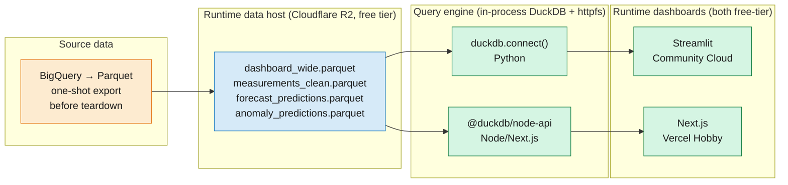

# 9. GCP Exit Plan

**Status**: planned, not executed. Trigger: the $300 GCP free-trial credit expires (≈90 days from project start) or financial-safety rationale kicks in sooner.

## Context

This repo was built on GCP first — dbt on BigQuery, FastAPI on Cloud Run, Artifact Registry, Workload Identity Federation, Terraform-managed. That architecture is the portfolio-evidence story and should stay **checked in**.

But keeping live GCP resources running past the free trial means activating billing with a real card — an unacceptable risk for a portfolio project. This doc captures the migration plan so the dashboards can keep running *without any GCP resources*, while the GCP architecture stays documented in-repo as the reference implementation.

## Goals

1. **Zero billable GCP resources** by day 19 (one day of buffer before the free trial ends).
2. **Both dashboards still live** — Streamlit and Next.js — with the same six tabs and equivalent data.
3. **Portfolio evidence preserved** — `terraform/`, `.github/workflows/`, `Dockerfile`, `app/` (FastAPI), `dbt_pollution/` target `dev`, and the architecture diagrams all stay in-repo, annotated as "historical" where appropriate.
4. **Code stays dialect-agnostic** — `dbt_pollution/` already has a `target: local` DuckDB profile. The frontend and Python data layer get a second backend adapter so the primary source can swap.

## Target architecture

**Why DuckDB-on-R2 over alternatives**:

| Alternative | Reason rejected |
|-------------|----------------|
| MotherDuck (hosted DuckDB) | Adds an auth dance and a service-to-manage just to replace "read a file" |
| DuckDB-WASM in the browser | Streamlit can't do it (Python server); works for Next.js alone but inconsistent across the two dashboards |
| Supabase / Postgres free tier | SQL dialect drift; 500MB RAM limits; vendor lock-in on a free tier that can change |
| GitHub LFS for parquet | 1 GB storage + 1 GB bandwidth/mo — tight for a public repo, LFS quotas burn fast |
| AWS S3 free tier | 12 months only, then $0.023/GB egress. R2 has no egress fee at all |

R2 wins: 10 GB free storage, zero egress fee, S3-compatible API, no Cloudflare Workers required, HTTPS URLs work directly with DuckDB `httpfs`.

## What stays in-repo unchanged (portfolio evidence)

| Path | Why it stays |
|------|-------------|
| `terraform/` (all modules) | IaC + WIF + KMS/SOPS skill evidence |
| `.github/workflows/docker-build-deploy.yml` | CI/CD pattern with WIF auth |
| `.github/workflows/terraform-*.yml` | Plan/apply gating with SOPS |
| `Dockerfile`, `docker-compose.yml` | Container + local stack pattern |
| `dbt_pollution/` with `target: dev` (BigQuery) | dbt + BQ portfolio story |
| `app/` (FastAPI on Cloud Run) | Serving pattern with typed Pydantic schemas |
| `src/data/loader.py` | BQ client + ADC auth reference |
| `frontend/src/lib/bq.ts`, `queries.ts` | Next.js + BigQuery integration reference |

**Key change**: workflows that would otherwise trigger on `push` get their triggers changed to `workflow_dispatch` only — so they don't actually run against torn-down infra but they're still present and readable.

## What gets added (runtime path)

### Python (Streamlit + existing ML pipeline)

- `src/data/loader_duckdb.py` — mirror of `loader.py`, same function signatures (`load_series`, `load_full_series`, `bq_to_dataframe`), queries via `duckdb.connect()` with `INSTALL httpfs; LOAD httpfs;` and reading parquet directly from R2 public URLs.
- `src/utils/data_backend.py` — helper that reads `DATA_BACKEND=duckdb|bigquery` env var and returns the right loader module. Everything downstream imports through this shim.
- `dashboard/data.py` — no changes beyond swapping `from src.data.loader import …` to `from src.utils.data_backend import loader` (applies to the single import site; individual pages call into `dashboard/data.py` and don't import from `src/` directly).

### Next.js

- `frontend/src/lib/duckdb.ts` — mirror of `bq.ts`. Exports a `runQuery<T>(sql, params)` with the same signature so `queries.ts` stays unchanged.
- `frontend/src/lib/queries.ts` — check SQL for BQ-specific syntax that DuckDB rejects. Known divergences to port:
  - `FORMAT_DATETIME('%Y-%m-%dT%H:%M:%S', ts)` → `strftime(ts, '%Y-%m-%dT%H:%M:%S')`
  - `DATETIME(@start)` / `TIMESTAMP(@start)` → `CAST(@start AS TIMESTAMP)`
  - `APPROX_QUANTILES(v, 100)[OFFSET(n)]` → `quantile_cont(v, n/100.0)`
  - `SAFE_DIVIDE(a, b)` → `a / NULLIF(b, 0)` or wrap in `try_cast`
  - `CAST(col AS FLOAT64)` → `CAST(col AS DOUBLE)`
  - Backtick-quoted table refs `` `proj.ds.tbl` `` → `read_parquet('https://…/tbl.parquet')`
- `frontend/src/lib/backend.ts` — same env-var shim as Python: `DATA_BACKEND` picks `bq.ts` or `duckdb.ts`. Default `duckdb`.

### Migration tooling

- `scripts/export_bq_to_parquet.py` — one-shot: runs while GCP is still live. Exports `presentation.dashboard_wide`, `logic.measurements_clean`, and the two prediction CSVs as parquet files into `outputs/parquet/`. Use BigQuery's `EXPORT DATA` statement for the BQ tables, direct conversion for the CSVs via `pandas → pyarrow`.
- `scripts/upload_parquet_to_r2.py` — uses `boto3` with R2's S3-compatible API to upload everything under `outputs/parquet/` to a public R2 bucket. Sets the right CORS headers for browser access (needed if we ever move DuckDB to WASM).
- `scripts/sync_outputs_to_gcs.py` (already exists) — deprecated after migration but keep in-repo as historical.

### Docs

- `docs/6-dashboard.md` — add a "Runtime" section explaining both dashboards now run from DuckDB-on-R2, with the BigQuery path kept in code for reference.
- `README.md` — add a one-paragraph "Deployment history" section near the top: "Built on GCP (terraform/, app/, docs/5), migrated to DuckDB-on-R2 after the free trial for cost reasons. GCP code preserved as reference." Plus update the mermaid diagram to show a second subgraph "Current runtime".
- `decisions.md` — add Decision 5 documenting the exit choice and why DuckDB+R2 over alternatives.

## What gets annotated as historical

| File | Annotation |
|------|------------|
| `terraform/README.md` (if exists) or top of `main.tf` | "Reference IaC for the GCP deployment (2026 Q1–Q2). Not actively applied — see docs/9 for the current runtime." |
| `.github/workflows/docker-build-deploy.yml` | Change trigger to `workflow_dispatch` only. Comment at top: "Historical — builds against Artifact Registry; project torn down after free trial." |
| `.github/workflows/terraform-*.yml` | Same — `workflow_dispatch` only, comment explaining. |
| `app/` | Top of `app/main.py`: "FastAPI reference implementation. Not deployed — see docs/9. Runs locally via `make serve`." |
| `Dockerfile` | One-liner comment: "Builds the FastAPI image. Was deployed to Cloud Run; now runs only via `docker compose up` for local testing." |
| `docs/5-infrastructure.md` | Add a front-matter banner: "Historical as of 2026-05. See docs/9 for the current runtime." |

## Decisions to lock before starting

1. **R2 bucket structure**
   - Proposed: `pollution-data` bucket with prefix `v1/` (allows future regenerations as `v2/` without breaking old deployments).
   - Public HTTPS URLs: `https://{account-hash}.r2.cloudflarestorage.com/pollution-data/v1/dashboard_wide.parquet`.

2. **FastAPI fate** — keep it running somewhere, or retire it?
   - **Retire** (recommended): dashboards never call it; ML live inference is not a portfolio demo requirement. Simplifies story. Code stays in-repo as historical.
   - Keep: redeploy to Fly.io free-tier; adds another moving part.

3. **Dbt fate** — keep both targets, or retire the BQ target?
   - **Keep both** (recommended): `dbt build --target dev` still works for any future reviewer with their own GCP project. `dbt build --target local` stays the actively-used path locally.

4. **Does the Next.js dashboard do any live inference?** No — dashboards only read aggregated data + prediction CSVs. FastAPI retirement is safe.

5. **How fresh does data need to be?** Static. Data covers 2021–2023 and doesn't grow. A single parquet export is sufficient — no scheduled refresh needed. This eliminates any "ETL runs where?" question.

## 20-day execution sequence

### Week 1 — build the replacement path (GCP still live)

- [ ] **Day 1** · Create Cloudflare R2 account + `pollution-data` bucket + public-read policy
- [ ] **Day 2** · Write `scripts/export_bq_to_parquet.py`; run locally; verify parquet files round-trip through DuckDB with row counts matching BQ
- [ ] **Day 3** · Write `scripts/upload_parquet_to_r2.py`; upload; verify HTTPS URLs resolve and DuckDB can query them
- [ ] **Day 4** · Add `src/data/loader_duckdb.py` + `src/utils/data_backend.py`; swap `dashboard/data.py` imports through the shim; `DATA_BACKEND=duckdb make dashboard` shows the same numbers as BQ locally
- [ ] **Day 5** · Add `frontend/src/lib/duckdb.ts` + `backend.ts`; port SQL for DuckDB dialect; `DATA_BACKEND=duckdb npm run dev` matches BQ output

### Week 2 — deploy dashboards off GCP

- [ ] **Day 6** · Deploy Streamlit to Community Cloud; confirm DuckDB driver works in their container; BQ path is unreachable (no secrets needed)
- [ ] **Day 7** · Deploy Next.js to Vercel (Hobby tier); confirm `@duckdb/node-api` works in Vercel Node runtime; set `DATA_BACKEND=duckdb` + R2 URL env vars
- [ ] **Day 8** · Side-by-side regression: Streamlit-live vs Streamlit-local vs previous GCP screenshots; all six tabs match to ≤0.1% on aggregates

### Week 3 — teardown and annotate

- [ ] **Day 15** · Update `docs/6-dashboard.md`, `docs/5-infrastructure.md`, `README.md`, `decisions.md` with historical-vs-current framing
- [ ] **Day 16** · Change triggers on `.github/workflows/*.yml` to `workflow_dispatch` only; add top-of-file comments
- [ ] **Day 17** · Inventory all billable GCP resources (`gcloud projects describe`, `gcloud run services list`, `bq ls`, etc.) and list in a cleanup checklist
- [ ] **Day 18** · `terraform destroy` in `terraform/` (will also clean up Cloud Run, Artifact Registry, IAM bindings); delete BigQuery datasets manually (Terraform doesn't manage internal tables)
- [ ] **Day 19** · Delete the GCP project entirely (or disable billing) — final defensive stop. Verify via `gcloud billing accounts list`
- [ ] **Day 20** · Update project status section of README. Tag release `v1.0-pre-gcp-exit` before the teardown PR, so the full-GCP snapshot stays reachable in git history

## Post-migration validation

- `make dashboard` opens Streamlit on :8501, all six tabs load from R2
- `make frontend` opens Next.js on :3000, all six tabs load from R2
- Visit deployed Vercel + Streamlit URLs; confirm zero errors in logs for 24h
- `gcloud billing accounts list` shows no billing account attached, or project deleted
- GitHub repo "Actions" tab shows workflows as "never triggered" or manual-only — no CI costs
- README's architecture diagram shows **both** subgraphs: "Historical GCP deployment" and "Current runtime"

## Rollback story

If DuckDB-on-R2 has a showstopper after migration:

1. Re-enable billing on a new GCP project (or the original if still within grace period)
2. `cd terraform/bootstrap && terraform apply` (recreates project + state bucket + KMS)
3. `cd terraform && terraform apply` (recreates BQ, Cloud Run, AR, IAM)
4. Replay dbt seeds: `cd dbt_pollution && dbt seed --target dev && dbt build --target dev`
5. Flip `DATA_BACKEND=bigquery` on Vercel and Streamlit Cloud
6. Total recovery time: ~1–2 hours because all the code is preserved

## Cost estimate (post-migration, steady state)

| Line | Monthly cost |
|------|--------------|
| Cloudflare R2 storage (~100MB) | $0 (free tier up to 10GB) |
| Cloudflare R2 egress | $0 (zero egress fees) |
| Cloudflare R2 class-A operations (uploads, ~monthly) | $0 (1M/mo free) |
| Cloudflare R2 class-B operations (downloads, ~10k/mo) | $0 (10M/mo free) |
| Vercel Hobby | $0 |
| Streamlit Community Cloud | $0 |
| GitHub (private or public repo) | $0 |
| **Total** | **$0** |

Budget alert: N/A — there is literally nothing that can charge.
